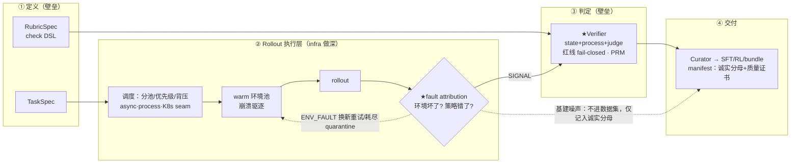
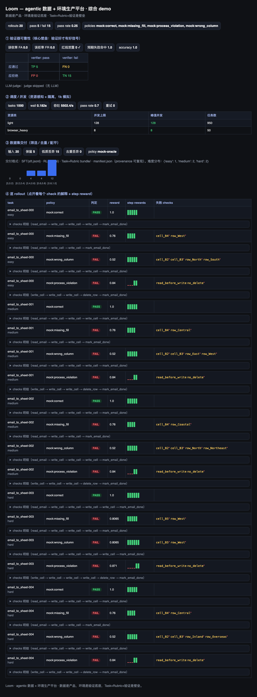
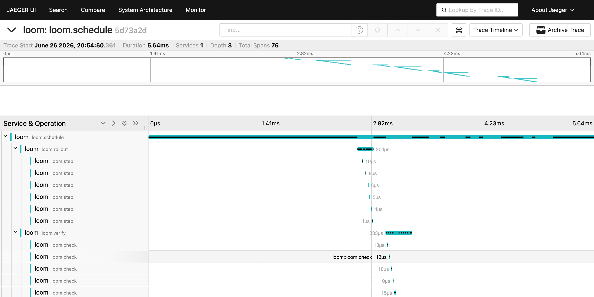

# Loom — 一页读懂

> 面试 take-home。**2 分钟读完这页**抓住全貌；想深挖看 [`docs/design.md`](docs/design.md)，想看它跑 `loom demo`（或直接翻 [`examples/`](examples/)）。

---

## 一句话

**Loom 把模型实验室那句模糊需求——"提升模型在真实多步骤 agentic 任务上的能力，给我训练环境和数据，量级 1k+"——变成一条可验证、可复现的数据生产线。**

立场（也是这道题的题眼）：

> **数据是产品；环境是验证底座，不是租给客户的 RL gym；Task + Rubric + 怎么验证好，才是壁垒。**
> Trajectory 是 commodity（谁都能打），不构成壁垒。

---

## 直接回答题目的四问

| 题目要问的 | Loom 怎么答 | 在哪 |
|---|---|---|
| **任务/环境怎么定义** | `TaskSpec` + `RubricSpec`（discriminated-union check DSL：state / process / judge），声明式、可复跑；worked example + 生成器（→1k） | `loom/contracts`、`loom/tasks` |
| **agent 在哪里跑** | **Rollout 执行层**：可插拔 executor（async 线程 / process 真隔离 / K8s seam）+ **warm 环境池**（崩溃驱逐）+ 资源感知分池调度（light / browser_heavy） | `loom/schedule`、`loom/envs` |
| **怎么判定成功** | 多层 `Verifier`（确定性 state + PRM 式 process + LLM judge）+ **红线 fail-closed 门控**（leakage=0）；**fault attribution** 保证 reward 只在合法 rollout 上算 | `loom/verify`、`loom/rollout` |
| **数据怎么流转交付** | `Curator` 筛选/去重/配平 → `sft.jsonl` / `rl.jsonl`（含 PRM step rewards）/ **Task+Rubric bundle** + `manifest`（诚实分母 + 质量证书 + provenance） | `loom/curate` |
| **1k+ 规模** | `schedule` 跑完 1k、峰值并发严格不超上限；诚实分母 + 成本模型；OTel→Jaeger 全链路 trace | `loom/schedule`、`loom/obs` |

---

## 架构：定义 → 跑 → 判定 → 交付



---

## 我在哪做深、为什么（这是架构判断，不是堆功能）

| 层 | 深度 | 为什么 |
|---|---|---|
| **验证（Verifier / Rubric / Quality 元层）** | 🟢 深度真跑 | 对模型公司，能精准区分对/错、红线零泄露的验证器，比"能跑 agent"值钱得多 |
| **fault attribution + 诚实会计** | 🟢 深度真跑 | 大规模跑环境最难的不是并发，是**别让基建噪声漏成训练信号** |
| **异构资源调度 + warm 池** | 🟢/🟡 真跑（1k 用 mock 模拟负载） | 重量环境贵 10–100×，分池/背压/池化是吞吐与稳定的关键；规模按真实设计、负载模拟 |
| **环境（BrowserEnv）** | 🟡 最小真实（1 domain 闭环） | 环境是**验证底座**，证明接口闭环即可，不必铺很多 domain |
| **K8s executor / 其它 env 类型** | ⚪ seam / 接口 | trajectory/横向扩展是 commodity，刻意不在这堆工程 |

**换一个 domain（如 coding），平台代码不动，只新增三样：一个 `Environment` 实现 + 一组 check + 几十条 gold。**

---

## 最能说明问题的两条

1. **outcome-only 验证不够**：`process_violation` 策略终态数值完全正确、reward 0.84（> 0.8 阈值），但因为**没先读邮件就写入**（幻觉）且**调了禁用的 `delete_row`**，被 PRM 过程检查 + 红线强制判 **fail**。
2. **基建噪声不得漏进信号**：浏览器崩了导致 reward=0，和模型真做错导致 reward=0，长得一样。Loom 把归因做成一等公民 `Outcome`——**reward 只在合法 rollout（SIGNAL）上计算，环境故障（ENV_FAULT）换新重试/耗尽隔离，结构上不可能进入数据集**；交付 manifest 的分母诚实区分"合法 reward=0 负样本"与"基建故障"。

---

## 关键结果（`loom demo`，确定性可复现）

| 维度 | 结果 |
|---|---|
| 红线泄露 leakage | **0**（错误/越权轨迹绝不被判 pass） |
| 误收率 FA / 误拒率 FR | 0 / 0 |
| 数据集筛选 | 20 候选 → 留 5（只留验证通过的正确轨迹），诚实分母区分 15 条合法负样本 |
| 1k 规模 | 跑完，峰值并发严格不超上限（browser_heavy≤8, light≤128）+ 成本模型 |
| fault attribution | 环境故障重试/隔离、不漏进信号；诚实分母可追溯（端到端测试覆盖） |
| 可观测 | OTel span 树跨线程/进程统一一条 trace（→ Jaeger，76 spans） |
| 测试 | `pytest` **48 passed** |

看板与真实 trace：




---

## 60 秒看它跑

```bash
pip install -e ".[browser,llm,dev,obs]"
loom demo                 # 验证器评估 + 全链路生成 + 1k 规模 → 打开 out/demo/report.html
loom eval-verifier        # 在 gold 集上度量验证器本身（最强信号：leakage/FA/FR）
pytest -q                 # 48 passed
```

**以上全部不需要任何 LLM key**（judge 无 key 时诚实跳过；主链路用确定性 MockPolicy）。想顺带验证真模型路径（可选佐证）：

```bash
export OPENAI_API_KEY=sk-...          # 或任意 OpenAI 兼容代理，见 .env.example
loom check-llm                        # 先确认 key/base/model 连通
loom run --policy llm --limit 1       # 真模型实跑一次（环境用轻量 mock）
```

> 给用 Claude Code / Codex review 的你：克隆后让 agent 跑 `pip install -e ".[dev]" && loom demo && pytest -q`，全程零 key、确定性可复现；想看真模型再按上面三行配自己的 key。`loom check-llm` 会明确告诉你连通/失败原因。

不想装环境：直接看 [`examples/sample-run/`](examples/sample-run/)（含 `manifest.json` 的诚实分母、`schedule.json` 的成本模型）与上面的截图。

---

## 深挖入口

- **全架构 + 取舍推理**：[`docs/design.md`](docs/design.md)（§8 = Rollout 执行层 / fault attribution）
- **可见产物**：[`examples/`](examples/) · **部署/可观测/扩展**：[`deploy/`](deploy/)
- **更完整的技术 README**：[`README.md`](README.md)

> **架构的好坏，量化成两件事：接一个新 domain 的边际成本有多低，以及基建故障不漏进训练信号的保证有多硬。**
