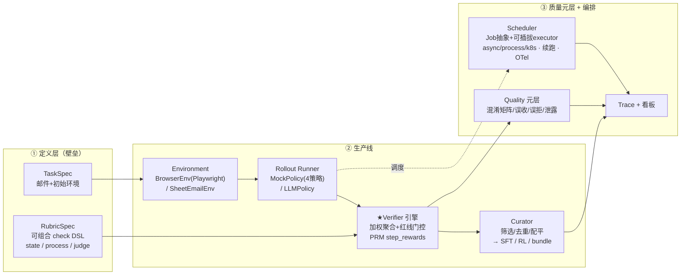
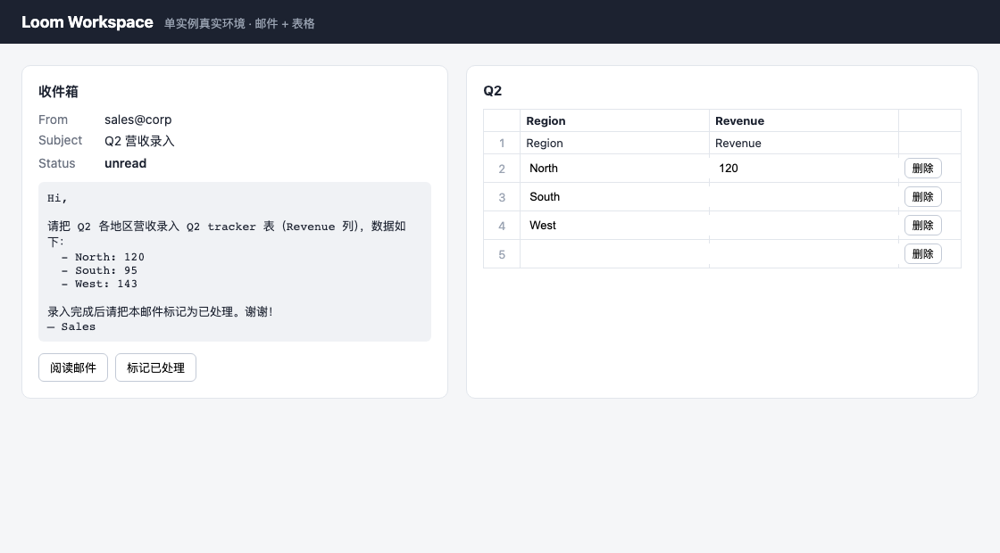

# Loom — Agentic 数据 + 环境生产平台

> 给模型实验室客户生产**高质量、可验证、可复现**的多步骤 agentic 训练数据。
> 立场：**数据是产品，环境是验证底座，Task + Rubric + 验证是壁垒**。

面对客户那句模糊的需求——"提升模型在真实多步骤 agentic 任务上的能力（读懂一封邮件、在应用/表格里操作几步、产出结果），给我训练环境和数据"——本仓库给出一条从 0 搭起的**数据生产线**，而不是一个"给客户模型在线训练的 RL 环境"。

为什么是这个立场？因为对模型公司来说：

- **Trajectory 是 commodity**——谁都能打各家模型的轨迹，不构成壁垒。
- 真正稀缺的是**怎么定义任务、怎么蒸好、怎么验证好**。验证好，模型在 RL 阶段才有干净信号（PRM 式过程奖励）。
- 所以 **RL environment 不是产品，而是数据生产后期做验证时用的底座**；交付物的核心是 **Task + Rubric + 验证过的数据**。

完整设计与取舍见 [`docs/design.md`](docs/design.md)。

---

## 架构



数据流：`Task/Rubric → Environment → Rollout → Verify → Curate → Dataset`，全程可 trace。

---

## 看板预览

一个综合 run 的静态看板（`loom demo` 产出）：验证器可靠性 + 调度并发 + 数据集交付 + 逐 rollout 的 check 解释下钻。


真实环境（Playwright 驱动的最小「邮件 + 表格」Web 应用，agent 在其中真实操作 DOM，verifier 检查真实状态）：



---

## 快速开始

```bash
python -m venv .venv && . .venv/bin/activate
pip install -e ".[browser,llm,dev]"     # browser=Playwright, llm=真实模型, dev=pytest
python -m playwright install chromium    # 仅真实浏览器环境需要

# 一键综合 demo：验证器评估 + 全链路生成 + 1k 规模模拟 → 单一看板
loom demo                                # 产物在 out/demo/，打开 out/demo/report.html

# 拆开跑：
loom eval-verifier                       # 在 gold 集上度量验证器（最强信号）
loom run --policy mock-all               # 生成→验证→筛选→导出数据集 + 看板
loom run --browser --policy mock:correct --limit 1   # 用真实 Playwright 浏览器环境
loom scale --n 1000 --executor async     # 规模/并发（async 队列+信号量）
loom scale --n 1000 --executor process   # 真进程池隔离
loom scale --n 1000 --store out/run.db   # 持久化；中断后加 --resume 断点续跑
loom report --run out/demo               # 重新渲染看板
loom k8s-manifest --n 3                   # 渲染 1 rollout=1 Pod 的样例 manifest
```

可观测（OpenTelemetry）：任意命令加 `--otel console`（离线看 span 树）或 `--otel otlp`（→ Jaeger）。
```bash
docker compose -f deploy/docker-compose.yaml up -d     # 起 Jaeger（OTLP:4318, UI:16686）
pip install -e ".[obs]" && LOOM_OTEL=otlp loom demo    # http://localhost:16686 看 trace 树
```

无 GPU、无 LLM key 也能完整跑通（judge 会**诚实跳过**，不伪造分数）。要开真实 LLM：

```bash
export LOOM_LLM_API_KEY=...               # OpenAI 兼容代理
# 默认 base=https://llm-proxy.tapsvc.com/v1, model=deepseek/deepseek-v4-flash（可用环境变量覆盖）
loom run --policy llm --limit 2 --browser
```

---

## 关键结果（`loom demo`，确定性，可复现）

| 维度 | 结果 |
|---|---|
| **红线泄露 leakage** | **0**（错误数据/越权轨迹绝不被判 pass） |
| 误收率 FA / 误拒率 FR | 0 / 0 |
| 预期失败命中率 | 100% |
| 数据集筛选 | 20 条候选 → 留 5 条（只留验证通过的正确轨迹） |
| 1k 规模 | 跑完，吞吐 ~9k/s，峰值并发严格不超上限（browser_heavy≤8, light≤128） |
| 调度 | async/process executor、断点续跑（重跑跳过已完成）、dead-letter 不丢弃，均有回归测试 |
| 可观测 | OTel span 树跨线程/进程统一 trace（`--otel console/otlp→Jaeger`） |
| 测试 | `pytest` 21 passed（verify / quality / report / browser / schedule / obs） |

**最能说明问题的一条**：`process_violation` 策略——终态数值完全正确，reward 0.84（高于 0.8 阈值）——但因为它**没先读邮件就写入（幻觉风险）**且**调用了禁用的 `delete_row`**，被 `read_before_write`（PRM step 级）和红线 `no_delete` 抓出，**强制判 fail**。这正是"outcome-only 验证不够、必须有过程/PRM 验证"的铁证。见 `examples/sample-run/`。

---

## 真实实现 vs 模拟（诚实边界）

| 组件 | 深度 |
|---|---|
| Verifier / Rubric 引擎（state + process + judge） | 🟢 深度真跑（核心壁垒） |
| Task/Rubric DSL + worked example + 生成器 | 🟢 深度真跑 |
| Quality 元层（gold 集 / 混淆矩阵 / 泄露） | 🟢 深度真跑 |
| MockPolicy 4 策略（造对/错轨迹喂验证器） | 🟢 主链路 |
| Rollout 执行层 / fault attribution（Outcome 归因 + 信号路由 + 诚实分母） | 🟢 深度真跑（基建噪声不漏进信号） |
| warm 浏览器池 + 崩溃驱逐 | 🟡 真实（池真实；1k 仍用 light 模拟；K8s pool=seam） |
| BrowserEnv（Flask + Playwright 真实驱动） | 🟡 最小真实（1 domain 闭环） |
| Curator + 三格式导出 + manifest | 🟡 真跑 |
| LLMPolicy 真模型 | 🟡 optional 佐证（需 key） |
| Scheduler（Job 抽象 + async/process executor + 优先级/背压 + 退避重试 + dead-letter） | 🟡 真跑；1k 用 MockPolicy 模拟 |
| 持久化续跑（SQLite run store）/ OTel 链路追踪（console/OTLP→Jaeger） | 🟡 真跑 |
| K8s executor / 其它 env 类型 | ⚪ manifest seam / 接口 |

设计**刻意把深度压在验证侧**：对模型公司而言，能精准区分对/错、红线零泄露的验证器，比"能跑 agent"重要得多。

---

## 仓库结构

```
loom/
  contracts/   Pydantic 数据契约（TaskSpec/RubricSpec/Trajectory/RewardReport/GoldSample/...）
  tasks/       email_to_sheet worked example + 按任务实例化 rubric + 生成器(→1k)
  envs/        Environment 接口 + SheetEmailEnv(轻量) + BrowserEnv(Playwright) + webapp(Flask)
  rollout/     Rollout runner + MockPolicy(4策略) + LLMPolicy + 安全 hooks
  verify/      ★Verifier 引擎：checks(state/process) + judge(LLM) + engine(聚合/红线/PRM)
  schedule/    Job 抽象 + 可插拔 executor(async/process) + SQLite 续跑 + dead-letter + k8s manifest seam
  obs/         OpenTelemetry 链路追踪（off/console/otlp→Jaeger，no-op 安全）
  curate/      筛选/去重/配平 → SFT / RL / Task+Rubric bundle + manifest
  quality/     gold 集构造 + 验证器可靠性度量
  trace/       JSONL 可追溯 + 静态 HTML 看板
  cli.py       typer 入口
docs/design.md 设计文档（含 Codex plan-review 修订）
deploy/        Jaeger docker-compose + k8s Job manifest 样例 + 部署/扩展说明
data/tasks/    声明式任务 + rubric 文件
examples/      看板/环境截图 + 一个 sample run 产物
tests/         pytest（verify / quality / report / browser / schedule / obs）
```

---

## 并发 / 隔离 / 规模 / 可观测（真实实现）

调度层围绕一个**可序列化的 `Job` 抽象 + 模块级 `execute_job` 入口**，因此同一个 rollout 能在三种隔离层级上跑（细节与命令见 [`deploy/README.md`](deploy/README.md)）：

- **可插拔 Executor**：
  - `async`（默认）—— 优先级队列 + N worker + per-class `asyncio.Semaphore` + 背压；in-process 线程隔离，OTel 全 span 树。
  - `process` —— 每个资源类一个进程池（size = 并发上限）→ 真 OS 进程隔离 + 多核。
  - **K8s seam** —— `loom k8s-manifest` 把每个 Job 渲染成 "1 rollout = 1 Job/Pod" 的 manifest（资源 request 按 `resource_class`），Pod 入口即 `loom run-job`。
- **隔离**：每个 rollout 独占 env 实例（BrowserEnv 用独立 browser context / process executor 用独立进程），零共享可变状态。1k 压测峰值并发严格不超上限。
- **弹性**：指数退避重试 + **dead-letter**（耗尽进 `status='dead'`，可追溯不丢弃）+ **SQLite run store 断点续跑**（同 `run_id --resume` 幂等跳过已完成）。
- **链路追踪（OpenTelemetry）**：`loom.schedule → loom.rollout → loom.step` 与 `loom.verify → loom.check` 的 span 树，跨线程/跨进程统一在一条 trace；`--otel console` 离线可看，`--otel otlp` → Jaeger（`deploy/docker-compose.yaml`）。

### Rollout 执行层 / fault attribution

大规模跑 agentic 环境，最难的不是并发，是**区分"环境坏了"还是"策略错了"**——二者表象都是 `reward=0`，含义却相反。不区分，基建噪声就会漏成训练信号。所以每条 rollout 先归因到一个 `Outcome`，再决定是否算 reward、是否重试：

- `COMPLETED`（含**合法 `reward=0` 负样本**）/ `POLICY_ERROR`（策略自己错，**不重试**）→ `SIGNAL` → 进验证器算**真实 reward** → 进数据集。
- `ENV_FAULT`（浏览器 crash/超时）→ 驱逐坏实例 + 幂等重试，耗尽进 **quarantine**；`HARNESS_FAULT`（我方 bug）→ 重试，耗尽进 **dead-letter**。二者都**不是信号、不进数据集**。
- **完整性保证**：reward 只在 `SIGNAL` rollout 上计算，基建噪声在**结构上不可能**进入数据集（与 verifier 的 `leakage=0` 内外呼应）。
- **诚实分母**：manifest 的 `rollout_accounting` 记录 attempted / completed / policy_error / env_fault(quarantined) / dead，并区分**合法 reward=0 负样本**与**基建故障**——数据集的分母可追溯、可审计。

这也是 warm 浏览器池与资源调度的交汇点：一个 `EnvFault` 既触发重试、又把崩溃实例清出池。完整设计见 [`docs/design.md` §8](docs/design.md)。

---

## 交付物格式（给模型公司）

`loom run` / `loom demo` 产出 `dataset/`：

- **`sft.jsonl`** — 蒸馏/模仿：`{instruction, messages(gold trajectory)}`。
- **`rl.jsonl`** — RL：`{task, env_seed, rubric_id, reward, step_rewards, trajectory}`（含 PRM 式过程奖励）。
- **`bundle/`** — **Task + Rubric spec**（最有价值，带版本，客户可自行复跑/复验）。
- **`manifest.json`** — provenance（模型/verifier 版本、配置、计数、reward 分布、质量指标），可复现。

---

## 设计取舍（几个关键判断）

1. **以"数据工厂"为主轴，而非"RL gym"**——直接对应客户的真实意图，避免做成"像 agent gym 的 demo"。
2. **Rubric 用 discriminated-union check DSL**（`cell_equals`/`row_exists`/`tool_preceded_by`/`forbidden_action_absent`/`llm_judge`…），而不是泛化的 `config: dict`——让"怎么验证"声明式、可读、可复跑。
3. **红线门控**：任一 `required` check 不过 → 整体强制 fail，与加权分数解耦——这是 leakage=0 的机制保证。
4. **MockPolicy 多策略当主链路**：用确定性 oracle 造出对/错轨迹喂验证器，零 token、可复现地证明"验证器能精准区分"；真 LLM 只作 optional 佐证，不绑定 demo 成败。
5. **judge 无 key 诚实跳过**：不伪造分数，并在报告里注明——验证器的诚实性本身也是质量的一部分。

---

本作业为面试 take-home。技术栈 Python；浏览器环境真实（Playwright）；1k 规模用 MockPolicy 模拟但调度并发按真实设计。
