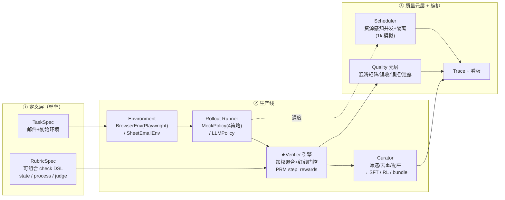

# Loom — Agentic 数据 + 环境生产平台

> 给模型实验室客户生产**高质量、可验证、可复现**的多步骤 agentic 训练数据。
> 立场：**数据是产品，环境是验证底座，Task + Rubric + 验证是壁垒**。

面对客户那句模糊的需求——"提升模型在真实多步骤 agentic 任务上的能力（读懂一封邮件、在应用/表格里操作几步、产出结果），给我训练环境和数据"——本仓库给出一条从 0 搭起的**数据生产线**，而不是一个"给客户模型在线训练的 RL 环境"。

为什么是这个立场？因为对模型公司来说：

- **Trajectory 是 commodity**——谁都能打各家模型的轨迹，不构成壁垒。
- 真正稀缺的是**怎么定义任务、怎么蒸好、怎么验证好**。验证好，模型在 RL 阶段才有干净信号（PRM 式过程奖励）。
- 所以 **RL environment 不是产品，而是数据生产后期做验证时用的底座**；交付物的核心是 **Task + Rubric + 验证过的数据**。

完整设计与取舍见 [`docs/design.md`](docs/design.md)。

---

## 架构



数据流：`Task/Rubric → Environment → Rollout → Verify → Curate → Dataset`，全程可 trace。

---

## 看板预览

一个综合 run 的静态看板（`loom demo` 产出）：验证器可靠性 + 调度并发 + 数据集交付 + 逐 rollout 的 check 解释下钻。


真实环境（Playwright 驱动的最小「邮件 + 表格」Web 应用，agent 在其中真实操作 DOM，verifier 检查真实状态）：


---

## 快速开始

```bash
python -m venv .venv && . .venv/bin/activate
pip install -e ".[browser,llm,dev]"     # browser=Playwright, llm=真实模型, dev=pytest
python -m playwright install chromium    # 仅真实浏览器环境需要

# 一键综合 demo：验证器评估 + 全链路生成 + 1k 规模模拟 → 单一看板
loom demo                                # 产物在 out/demo/，打开 out/demo/report.html

# 拆开跑：
loom eval-verifier                       # 在 gold 集上度量验证器（最强信号）
loom run --policy mock-all               # 生成→验证→筛选→导出数据集 + 看板
loom run --browser --policy mock:correct --limit 1   # 用真实 Playwright 浏览器环境
loom scale --n 1000                      # 规模/并发模拟（资源感知调度）
loom report --run out/demo               # 重新渲染看板
```

无 GPU、无 LLM key 也能完整跑通（judge 会**诚实跳过**，不伪造分数）。要开真实 LLM：

```bash
export LOOM_LLM_API_KEY=...               # OpenAI 兼容代理
# 默认 base=https://llm-proxy.tapsvc.com, model=deepseek/deepseek-v4-flash（可用环境变量覆盖）
loom run --policy llm --limit 2 --browser
```

---

## 关键结果（`loom demo`，确定性，可复现）

| 维度 | 结果 |
|---|---|
| **红线泄露 leakage** | **0**（错误数据/越权轨迹绝不被判 pass） |
| 误收率 FA / 误拒率 FR | 0 / 0 |
| 预期失败命中率 | 100% |
| 数据集筛选 | 20 条候选 → 留 5 条（只留验证通过的正确轨迹） |
| 1k 规模 | 跑完，吞吐 ~9k/s，峰值并发严格不超上限（browser_heavy≤8, light≤128） |
| 测试 | `pytest` 9 passed（含真实 Playwright 浏览器用例） |

**最能说明问题的一条**：`process_violation` 策略——终态数值完全正确，reward 0.84（高于 0.8 阈值）——但因为它**没先读邮件就写入（幻觉风险）**且**调用了禁用的 `delete_row`**，被 `read_before_write`（PRM step 级）和红线 `no_delete` 抓出，**强制判 fail**。这正是"outcome-only 验证不够、必须有过程/PRM 验证"的铁证。见 `examples/sample-run/`。

---

## 真实实现 vs 模拟（诚实边界）

| 组件 | 深度 |
|---|---|
| Verifier / Rubric 引擎（state + process + judge） | 🟢 深度真跑（核心壁垒） |
| Task/Rubric DSL + worked example + 生成器 | 🟢 深度真跑 |
| Quality 元层（gold 集 / 混淆矩阵 / 泄露） | 🟢 深度真跑 |
| MockPolicy 4 策略（造对/错轨迹喂验证器） | 🟢 主链路 |
| BrowserEnv（Flask + Playwright 真实驱动） | 🟡 最小真实（1 domain 闭环） |
| Curator + 三格式导出 + manifest | 🟡 真跑 |
| LLMPolicy 真模型 | 🟡 optional 佐证（需 key） |
| Scheduler 调度（信号量/隔离/重试/吞吐） | ⚪ 轻量真实；1k 用 MockPolicy 模拟 |
| 其它 env 类型 / K8s·checkpoint·退避 | ⚪ 接口 / 文档映射 |

设计**刻意把深度压在验证侧**：对模型公司而言，能精准区分对/错、红线零泄露的验证器，比"能跑 agent"重要得多。

---

## 仓库结构

```
loom/
  contracts/   Pydantic 数据契约（TaskSpec/RubricSpec/Trajectory/RewardReport/GoldSample/...）
  tasks/       email_to_sheet worked example + 按任务实例化 rubric + 生成器(→1k)
  envs/        Environment 接口 + SheetEmailEnv(轻量) + BrowserEnv(Playwright) + webapp(Flask)
  rollout/     Rollout runner + MockPolicy(4策略) + LLMPolicy + 安全 hooks
  verify/      ★Verifier 引擎：checks(state/process) + judge(LLM) + engine(聚合/红线/PRM)
  schedule/    资源感知并发调度（asyncio 信号量 + 隔离 + 重试 + 吞吐统计）
  curate/      筛选/去重/配平 → SFT / RL / Task+Rubric bundle + manifest
  quality/     gold 集构造 + 验证器可靠性度量
  trace/       JSONL 可追溯 + 静态 HTML 看板
  cli.py       typer 入口
docs/design.md 设计文档（含 Codex plan-review 修订）
data/tasks/    声明式任务 + rubric 文件
examples/      看板/环境截图 + 一个 sample run 产物
tests/         pytest（verify / quality / browser）
```

---

## 并发 / 隔离 / 规模（设计当真）

- **隔离**：每个 rollout 独占自己的 env 实例（BrowserEnv 用独立 browser context），rollout 间零共享可变状态。
- **资源感知**：按 env 的 `resource_profile` 分级限流——`browser_heavy`（重内存）少并发，`light` 多并发。用 per-class `asyncio.Semaphore` 实现，1k 压测峰值并发严格不超上限。
- **弹性**：超时 + 有限次重试 + 幂等 `trace_id`。
- **横向扩展映射**：本地 asyncio 池是单机 stand-in；真实部署时 **1 rollout = 1 K8s Job/Pod**，资源 request 匹配 profile，scheduler 变 controller，结果汇聚对象存储。checkpoint 续跑、指数退避在此映射下补齐（本仓库刻意不镀金）。

---

## 交付物格式（给模型公司）

`loom run` / `loom demo` 产出 `dataset/`：

- **`sft.jsonl`** — 蒸馏/模仿：`{instruction, messages(gold trajectory)}`。
- **`rl.jsonl`** — RL：`{task, env_seed, rubric_id, reward, step_rewards, trajectory}`（含 PRM 式过程奖励）。
- **`bundle/`** — **Task + Rubric spec**（最有价值，带版本，客户可自行复跑/复验）。
- **`manifest.json`** — provenance（模型/verifier 版本、配置、计数、reward 分布、质量指标），可复现。

---

## 设计取舍（几个关键判断）

1. **以"数据工厂"为主轴，而非"RL gym"**——直接对应客户的真实意图，避免做成"像 agent gym 的 demo"。
2. **Rubric 用 discriminated-union check DSL**（`cell_equals`/`row_exists`/`tool_preceded_by`/`forbidden_action_absent`/`llm_judge`…），而不是泛化的 `config: dict`——让"怎么验证"声明式、可读、可复跑。
3. **红线门控**：任一 `required` check 不过 → 整体强制 fail，与加权分数解耦——这是 leakage=0 的机制保证。
4. **MockPolicy 多策略当主链路**：用确定性 oracle 造出对/错轨迹喂验证器，零 token、可复现地证明"验证器能精准区分"；真 LLM 只作 optional 佐证，不绑定 demo 成败。
5. **judge 无 key 诚实跳过**：不伪造分数，并在报告里注明——验证器的诚实性本身也是质量的一部分。

---

本作业为面试 take-home。技术栈 Python；浏览器环境真实（Playwright）；1k 规模用 MockPolicy 模拟但调度并发按真实设计。
