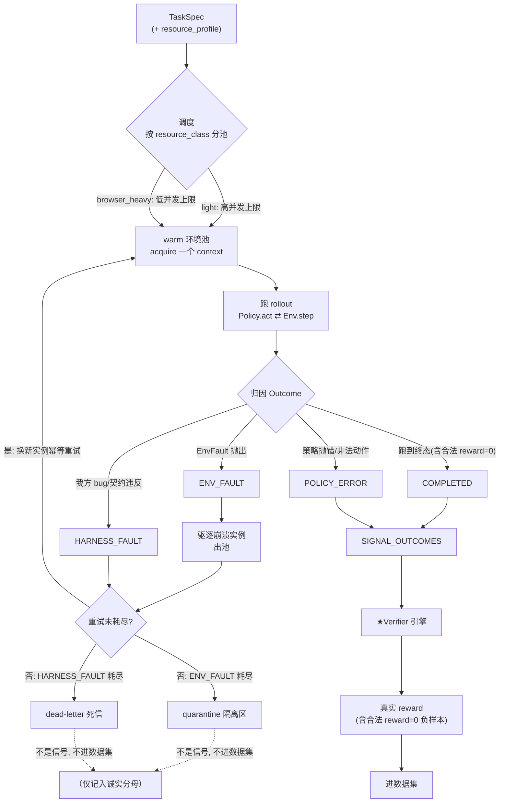

# Agentic 数据 + 环境生产平台 — 设计文档

> 代号：**Loom**（把验证过的 agentic 轨迹"织"成训练数据）
> 日期：2026-06-26
> 状态：已实现并通过测试（`pytest` 全绿）；下文描述与代码一致。

---

## 1. 背景与问题重构

客户（模型实验室）的原始需求很模糊：

> "提升模型在真实多步骤 agentic 任务上的能力——比如读懂一封邮件的要求，在一个应用/表格里操作几步、产出结果。给我这类任务的高质量训练环境和数据。"

**关键认知（决定整套设计的立场）：**

1. **交付给模型公司的核心是「数据本身」，其中最核心的是 Task + Rubric。** Trajectory 是 commodity——谁都能打各家模型的轨迹，不是壁垒。
2. **RL environment 不是产品，而是"数据生产后期做验证时用的环境"。** 环境服务于数据，不是反过来。
3. **真正的壁垒 = 怎么「定义」任务、怎么「蒸」好、怎么「验证」好。** 验证好 → 给客户模型在 RL 阶段更好的信号（PRM 式过程奖励）。
4. 我们**不做给客户的自定义 harness**；客户拿数据做 Agentic RL / 蒸馏（SFT）来训练模型本身。我们内部有一套数据生成 harness，仅服务于数据生产。

因此本平台不是"给客户一个在线 RL 环境"，而是**一条 agentic 数据生产线**：以 Task 设计 + Rubric + 多层 Verifier 为核心壁垒，环境是验证底座，规模 ≥1k 且并发隔离，最终交付**高质量、可验证、可复现的数据**。

> **实现重心**：本仓库要证明的不是"能跑 agent"，而是**"能定义任务 + 能精准验证对错 + 能产出可解释、可复现的数据"**。因此最深的真实实现压在 **Task/Rubric DSL + Verifier 引擎 + Gold 集 + Quality 元层**；环境只做最小真实闭环；策略以 **MockPolicy 多策略**为主链路（制造对/错轨迹给验证器区分），真 LLM 仅作 optional 佐证。

---

## 2. 目标与非目标

### 目标
- 端到端可演示的数据生产线：任务/环境定义 → rollout → 多层验证 → 筛选 → 交付。
- **Verifier / Rubric 引擎**真实可跑、可组合、可解释、可复跑（核心壁垒）。
- **Quality 元层**：在 gold 集上度量验证器本身（误收/误拒/泄露/judge 方差 + 混淆矩阵）。
- 浏览器环境真实可用（最小 Web 应用 + Playwright），验证落在真实环境状态上。
- 设计上充分支持 **1k+ 任务、并发、rollout 隔离、资源感知调度**（代码做轻量演示，重型恢复机制写文档映射）。
- 可视化 preview（看板/报告）+ 含架构图的 README。

### 非目标（YAGNI）
- 不做真正的分布式/K8s 部署；不做 checkpoint 续跑、指数退避等重型恢复（写 README 映射）。
- 不真烧 1k 规模 token；真 LLM 只跑 1~2 条佐证，1k 用 MockPolicy 模拟。
- 不实现 API/文件/computer-use 等其它环境类型（只留接口）。
- 不做训练侧（SFT/RL 训练循环）；只产出数据。
- 不做向量库/语义去重；去重用结构 hash，存储用本地文件（JSONL/SQLite）。

---

## 3. 目标用户与约束

- **客户**：国内大模型厂商（Tier1 frontier labs；Tier2 二线开始做模型的大厂，如美团、米哈游）。特点：很多连 Coding 数据都没做好，缺评测/验证 know-how。
- **规模约束**：系统设计需支持 ≥1000 条任务、并发跑、rollout 互相独立。
- **资源约束**：不同环境资源画像不同（browser 重内存 / 简单 env 轻量）→ 差异化调度。
- **可追溯**：每条 rollout 全程可 trace、可复现。

---

## 4. 架构总览

一条任务的生命周期（数据流主轴）：

```
TaskSpec (+ RubricSpec)
   │
   ▼  [Scheduler: 资源感知 / 隔离 / 并发（轻量演示）]
Environment.reset(seed) ──► Observation
   │
   ▼  [Rollout Runner: 内部数据生成 harness]
Policy.act ⇄ Env.step  (循环) ──► Trajectory + 终态 EnvState
   │
   ▼  [Verifier / Rubric 引擎 ★核心壁垒]
   ├─ state  检查（确定性，作用于终态，含红线 required）
   ├─ process 检查（作用于步骤，PRM 式 step reward 来源）
   └─ judge  检查（LLM，模糊标准，结构化打分+理由）
   │  → RewardReport（total + 逐 check 拆解 + step_rewards + pass/fail）
   ▼  [Curator: 阈值筛选 / 结构去重 / 难度配平 / 切分]
Dataset 交付物：
   ├─ SFT / 蒸馏数据
   ├─ RL 数据（task + env seed + rubric_ref + 离线 (traj, reward) + step_rewards）
   └─ Task+Rubric spec bundle（最有价值、可复跑、带版本）
   + Manifest（模型 / verifier 版本 / 配置哈希，可复现）
   │
   ▼
Trace / Dashboard preview
   └─ Quality 元层：通过率、reward 分布、混淆矩阵、误收/误拒/泄露
```

横切：**Trace/可观测**、**Quality/Eval 元层**、**配置/版本**。

---

## 5. 核心数据契约（Pydantic v2；以下为示意，非最终签名）

契约层是流水线的"接口"，所有模块只依赖契约。

```python
# ---------- 任务定义 ----------
class TaskSpec:
    task_id: str
    domain: str                  # "email_to_sheet"
    difficulty: Literal["easy","medium","hard"]
    instruction: str             # 给 agent 的要求（含邮件正文+目标）
    env_type: str                # "browser" | ...
    env_seed: dict               # 环境初始状态种子（决定可复现）
    allowed_tools: list[str]
    rubric_id: str
    max_steps: int = 20
    metadata: dict = {}

# ---------- 评分标准：可组合 check（★壁垒）----------
# 用 discriminated union 表达具体 check，杜绝泛化的 config: dict
Scope = Literal["final","step","trajectory"]

class StateCheck:                # 作用于终态 env state（确定性，高可信）
    kind: Literal["state"] = "state"
    op: Literal["cell_equals","cell_matches","row_exists","state_equals","state_contains"]
    args: dict                   # 如 {"sheet":"Q2","cell":"B2","value":120}
    scope: Scope = "final"

class ProcessCheck:              # 作用于轨迹步骤（PRM step reward 来源）
    kind: Literal["process"] = "process"
    op: Literal["tool_sequence_contains","tool_used","forbidden_action_absent","max_steps","no_error_steps"]
    args: dict
    scope: Scope = "trajectory"  # 部分 op 可设 step → 产出 step 级信号

class JudgeCheck:                # LLM-judge（模糊标准）
    kind: Literal["judge"] = "judge"
    rubric_text: str             # 结构化评分说明
    scale: int = 5
    scope: Scope = "trajectory"

class RubricCheck:
    check_id: str
    weight: float
    required: bool = False       # required 不过 → 整体强制 fail（安全红线）
    spec: StateCheck | ProcessCheck | JudgeCheck

class RubricSpec:
    rubric_id: str
    version: str
    checks: list[RubricCheck]
    aggregation: Literal["weighted_sum"] = "weighted_sum"
    pass_threshold: float = 0.8

# ---------- rollout 产物（commodity）----------
class Step:
    index: int
    observation: dict
    thought: str | None
    action: dict                 # {name, args}
    tool_result: dict | None

class Trajectory:
    task_id: str; attempt: int; policy: str
    steps: list[Step]
    final_state: dict            # 终态快照（供 state 检查）
    status: Literal["completed","timeout","error","max_steps"]
    cost: dict; trace_id: str

# ---------- 验证结果 ----------
class CheckResult:
    check_id: str; kind: str
    score: float                 # [0,1]
    passed: bool; weight: float
    scope: Scope
    step_index: int | None       # step 级 check 绑定到具体步
    rationale: str               # 可解释：state 给断言详情，judge 给理由

class RewardReport:
    task_id: str; trace_id: str
    total_reward: float          # [0,1] 加权聚合；required 不过 → passed=False（total 仍保留原值，故可呈现"高分但判负"，见 §6.6 / §13）
    passed: bool
    step_rewards: list[float]    # 由 scope=step 的 CheckResult 按步聚合而来
    checks: list[CheckResult]
    verifier_version: str

# ---------- Gold 集（度量验证器本身）----------
class GoldSample:
    sample_id: str; task_id: str
    trajectory: Trajectory
    should_pass: bool
    negative_type: Literal["none","missing_fill","wrong_column","process_violation"]
    is_redline: bool             # 红线负样本：绝不允许被判 pass（泄露=0 目标）
    expected_failed_checks: list[str]
    human_rationale: str

# ---------- 交付物 ----------
class DatasetManifest:
    dataset_id: str; created_at: str; policy_model: str
    verifier_versions: dict
    counts: dict                 # total/kept/by_domain/by_difficulty
    reward_distribution: dict
    quality_metrics: dict        # 混淆矩阵 / FA / FR / leakage / judge 方差
    provenance: dict             # 各组件版本 + 配置哈希
```

---

## 6. 模块设计（清晰边界 | 真跑深度分级）

每模块标注 **真跑深度**：🟢 深度真跑（核心壁垒）/ 🟡 最小真实 / ⚪ 模拟或接口。

### 6.1 🟢 Task & Rubric 定义层（契约 + 壁垒）
- **做什么**：声明式定义任务与 rubric；任务生成器（参数化放大到 1k）。
- **接口**：`load_tasks()`、`load_rubric(id)`、`generate_tasks(template, n)`。
- **Worked example（`email_to_sheet` 任务族，必须落地）**：
  - **邮件**：来自"销售经理"，要求把 Q2 三地区营收录入 tracker 表：North=120 / South=95 / West=143，并把邮件标记为已处理。
  - **初始环境**：收件箱 1 封未读；表 `Q2` 表头 `Region|Revenue`，数据区空。
  - **目标终态**：表含 3 行正确数据；邮件 status=done。
  - **allowed_tools**：`read_email, mark_email_done, read_sheet, write_cell`。
  - **Rubric**（混合三类 check）：
    | check_id | kind | op/内容 | required | scope |
    |---|---|---|---|---|
    | row_north | state | `cell_equals B2=120`（North 行） | ✅ 红线 | final |
    | row_south | state | `cell_equals B3=95` | ✅ 红线 | final |
    | row_west | state | `cell_equals B4=143` | ✅ 红线 | final |
    | email_done | state | `state_equals email.status=done` | ✗ | final |
    | read_before_write | process | `tool_preceded_by`：每次 write_cell 前必须先 read_email（反幻觉） | ✅ 红线 | step |
    | no_delete | process | `forbidden_action_absent delete_row` | ✅ 红线 | trajectory |
    | step_budget | process | `max_steps <= 15` | ✗ | trajectory |
    | faithful | judge | "是否正确理解三地区数字且未编造数据" | ✗ | trajectory |
- **真跑**：🟢 5 个该族任务（参数化不同地区/数值）+ rubric；生成器放大到 1k（给规模模拟用）。

### 6.2 🟡 Environment 抽象（验证底座）
- **接口**：`reset(seed)->Obs` / `step(action)->Obs` / `get_state()->dict` / `tools()->list` / `close()`；属性 `resource_profile`（light / browser_heavy）。
- **真实实现 `BrowserEnv`**：最小本地 Web 应用（邮件收件箱 + 表格，Flask）；Playwright 真实驱动，每实例独立 browser context（廉价隔离）；`get_state()` 读真实 DOM/应用状态 → 喂 verifier。资源画像 `browser_heavy`。
- **接口-only ⚪**：`api`/`file`/`computer_use` 仅声明，证明可扩展。
- **真跑**：🟡 BrowserEnv 跑通 1 个 domain 的最小闭环（证明 state 来自真实 DOM 即可）。

### 6.3 Rollout Runner（内部数据生成 harness）
- **接口**：`run_rollout(task, env, policy) -> Trajectory`；`Policy.act(obs, scratchpad) -> action`。
- **🟢 `MockPolicy`（主链路）**：脚本化、确定性，按策略制造对/错轨迹，专门喂给 verifier 区分：
  - `correct`：正确填 3 行 + 标记 done → 应 pass。
  - `missing_fill`：只填 2 行 → 触发 required 行检查 fail（误收测试）。
  - `wrong_column`：把营收写错单元格/错位 → state 检查 fail。
  - `process_violation`：达成终态但跳过 read_email（幻觉）/超步数/用 forbidden 动作 → 仅过程检查能抓出（论证 outcome-only 不够，需 PRM 式过程奖励）。
- **🟡 `LLMPolicy`（optional 佐证）**：真 Claude/GPT，tool-calling + scratchpad；仅跑 1~2 条产出"真实轨迹"截图，**不作为 demo 成败依赖**。
- **安全**：高风险写操作走 pre-action hook 拦截（pre-tool-use 式安全门，可挡越权/指令注入）。

### 6.4 🟡 Scheduler / 编排（见 deploy/README.md）
- **Job 抽象**：可序列化 `Job` + 模块级 `execute_job` —— 同一 rollout 可在线程/进程/Pod 上跑。
- **可插拔 Executor**：`async`（优先级队列 + N worker + per-class `asyncio.Semaphore` + 背压）/ `process`（每资源类一个进程池=该类并发上限，真 OS 进程隔离 + 多核）/ **K8s seam**（`render_job_manifest` 把 Job 渲染成 1 Pod/rollout 的 manifest，资源 request 按 profile）。
- **隔离 + 资源感知**：每 rollout 独立 env 实例、零共享；分级并发上限严格不超。
- **弹性**：指数退避重试 + **dead-letter**（耗尽进 `status='dead'`，可追溯不丢弃）+ **SQLite run store 断点续跑**（同 `run_id --resume` 幂等跳过已完成）。
- **可观测**：OpenTelemetry span 树（schedule→rollout→step / verify→check），跨线程/进程统一 trace；`--otel console`/`otlp→Jaeger`。
- **真跑 or 模拟**：调度/续跑/dead-letter/OTel 全真跑；1k 的 rollout 内容仍用 MockPolicy 模拟以省 token；K8s 为 manifest seam（不实际 apply）。

### 6.5 🟡 Curator / 数据集构建
- **接口**：`curate(reports, trajectories, policy) -> (Dataset, DatasetManifest)`。
- **逻辑**：reward 阈值筛选；**结构 hash 去重**（非语义）；按域/难度**计数配平**；train/val 切分。
- **导出三格式**：① SFT `{instruction, gold_trajectory}`；② RL `{task, env_seed, rubric_ref, (traj,reward), step_rewards}`；③ Task+Rubric bundle（带版本，可复跑）。附 `DatasetManifest`（provenance）。

### 6.6 🟢 Quality / Eval 元层（★面试官最在意）
- **接口**：`evaluate_verifier(gold_set) -> QualityMetrics`。
- **做什么**：在 **gold 集**（每条带 `should_pass / negative_type / is_redline / expected_failed_checks`）上跑 verifier，输出：
  - **混淆矩阵** + **误收率(FA)/误拒率(FR)**。
  - **泄露(leakage)**：任何 `is_redline` 负样本被判 pass 即泄露（目标 = 0）。
  - **judge 方差/一致性**：judge check 跑 N 次的稳定性。
  - **expected_failed_checks 命中率**：verifier 是否抓到了"预期该挂的 check"。
- **真跑**：🟢 在小 gold 集（≥3 类负样本 ×每类若干）上真跑。

### 6.7 横切：Trace / Dashboard preview
- 每 rollout 一条 JSONL trace（task_id, attempt, status, reward 拆解, step_rewards, cost, duration）。
- **preview**：静态 HTML（Jinja2）：任务汇总、通过率、reward 分布、**逐 check 解释 + step reward**、逐任务 trace 下钻、**验证器可靠性面板（混淆矩阵/FA/FR/泄露）**。重解释、轻美化。

---

## 7. 并发与规模模型（设计当真，代码轻量）

- **隔离**：rollout 间无共享可变状态；每 env 实例独占（browser context / 进程 / pod）。
- **资源感知**：按 `resource_profile` 分级限流，避免 heavy env 打爆内存。
- **背压**：bounded queue；生产者-消费者。
- **可扩展到 1k+**：本地 asyncio 池 = 单机 stand-in；横向扩展 1 rollout=1 K8s Job/Pod（README 映射）。
- **演示**：MockPolicy 把 1k 任务在分级信号量下跑完，输出吞吐/并发摘要 + trace，证明并发与隔离模型成立。

---

## 8. Rollout 执行层（调度 + fault attribution）

§7 把"并发与规模模型"当真设计了；本节回答紧接的下一个问题：**这套模型在执行时怎么大规模、稳定地跑，且不让基建噪声污染训练信号。** 这是"数据生产线"区别于"能跑 agent 的 demo"的地方——一旦要跑 1k+ 且要交付**可信的数据**，执行层就不再是"把 rollout 并发起来"这么简单。

执行层由**两根支柱**支撑，它们在 **warm 环境池**处交汇：

1. **异构资源调度**（承接 §7）：按 `resource_profile` 分池限流，让昂贵的 `browser_heavy` 环境不打爆机器，同时让 `light` 环境吃满并发。
2. **Fault attribution（故障归因）**：大规模跑 agentic 环境，最难的不是并发，而是**区分"环境坏了"还是"策略错了"**——二者在表象上都是 `reward=0`，但含义截然相反。不区分，基建噪声就会直接漏成训练信号：你以为收的是"模型做错了"的负样本，其实是"浏览器崩了"。

交汇点是 warm 环境池：重量环境起一个很贵（冷启动 Playwright + Flask 应用），所以池子**复用底层进程、每个 rollout 发一个全新 browser context 保隔离**；而一个环境故障（`EnvFault`）在这里同时触发两件事——**既触发该 rollout 的幂等重试，又把崩溃的实例从池里驱逐**。资源调度与故障归因在这一个动作里耦合，正是执行层的系统观所在。

### 8.1 把归因做成一等公民：`Outcome` 枚举

每条 rollout 跑完先不急着算 reward，而是先归因到一个 `Outcome`。归因结果决定它**是否是合法信号、是否重试、耗尽后如何处置**：

| Outcome | 含义 | 是否重试 | 是否计入信号 | 耗尽处置 |
|---|---|---|---|---|
| `COMPLETED` | 跑到终态、无基建故障（**含合法 `reward=0` 负样本**） | 否 | ✅ 是 | — |
| `POLICY_ERROR` | 策略自身错了（`act` 抛错 / 输出非法动作 / 不可恢复地偏离） | **否** | ✅ 是 | — |
| `ENV_FAULT` | 环境/基建故障（浏览器 crash/hang、子进程退出、`navigate` 超时） | 是（幂等） | ❌ 否 | **quarantine**（隔离区，可追溯） |
| `HARNESS_FAULT` | 我方代码/配置故障（契约违反、序列化失败、bug） | 是 | ❌ 否 | **dead-letter**（死信，可追溯） |

两个判定集合驱动路由：

- `SIGNAL_OUTCOMES = {COMPLETED, POLICY_ERROR}` —— 只有这两类才跑验证器、产出**真实 reward**。
- `RETRYABLE_OUTCOMES = {ENV_FAULT, HARNESS_FAULT}` —— 只有这两类才进重试/退避循环。

两个关键判断值得点明：

- **`POLICY_ERROR` 不重试**：策略自己出错是**合法的负信号**（模型确实做错了），重试只会抹掉这个信号、还浪费资源。它和 `COMPLETED` 一样进验证器，只是大概率拿到低 reward。
- **`COMPLETED` 含合法 `reward=0`**：跑到终态但没达成目标（填错了数、漏了行）是**模型的错，不是环境的错**——这是数据集最需要的高质量负样本，绝不能被当成"失败"丢弃或重试。

> 接口侧的契约（与 §6.2 Environment 抽象对齐）：`env.reset / step / get_state` 遇到**基建故障**时 `raise EnvFault`；而**工具级错误**（未知 tool、参数非法、越界操作）**不 raise**，而是作为 `obs["error"]` 返回给策略——这是给策略的**合法反馈**（模型应当学会从错误里恢复），不是基建故障。这条边界划错，要么把模型该学的东西误判成环境故障重试掉，要么把真故障漏成信号。

### 8.2 Fault-attribution 流程



一句话读图：task 按 `resource_class` 分池调度 → 从 warm 池 acquire 一个 context 跑 rollout → 归因；`ENV_FAULT` 既驱逐坏实例又换新实例重试、耗尽进 quarantine，`HARNESS_FAULT` 重试、耗尽进 dead-letter；只有 `SIGNAL`（`COMPLETED`/`POLICY_ERROR`）才进验证器产出 reward，**只有合法 reward 进数据集**。

### 8.3 完整性保证（headline）

> **reward 只在 SIGNAL rollout 上计算，基建噪声在结构上不可能进入数据集。**

这是整个执行层的 headline。重试、退避、dead-letter、quarantine 这些机制看起来是"可靠性工程"，但它们的**本质统一在一句话**：不让基建故障漏成训练信号。验证器只能看到 `SIGNAL_OUTCOMES` 里的轨迹，`ENV_FAULT`/`HARNESS_FAULT` 在被路由到验证器**之前**就已经被分流走了——这不是"过滤掉脏数据"的事后清洗，而是一条**结构上不可逾越的边界**：脏数据根本没有进入计算 reward 的代码路径。

对照 §6.6 Quality 元层的 `leakage=0`（红线负样本零误收）：那是**验证器内部**的完整性保证；本节是**验证器外部**的完整性保证。二者合起来，数据集的每一个 reward 都既"判得对"又"该判"。

### 8.4 诚实分母（rollout_accounting）

交付 manifest 不只报"留了多少条好数据"，还报一份诚实的执行账本 `rollout_accounting`：

```
attempted        # 总共发起多少次 rollout
completed        # COMPLETED（其中区分 reward>0 与合法 reward=0 负样本）
policy_error     # POLICY_ERROR（合法负信号）
env_fault        # ENV_FAULT 耗尽进 quarantine 的数量
dead             # HARNESS_FAULT 耗尽进 dead-letter 的数量
```

关键是**区分"合法 reward=0 负样本"与"基建故障"**：前者是数据集想要的高质量负样本，后者是必须排除的噪声。二者若混在一个"失败"计数里，分母就不诚实——客户无法判断"这批数据的负样本是模型真做错了，还是环境抽风了"。有了这份账本，数据集的分母**可追溯、可审计**：每条没进数据集的 rollout 都能说清楚为什么。

### 8.5 成本模型

吞吐被最贵的资源类卡住。`light` 环境可以开到很高并发（上限 128 量级），但 `browser_heavy` 因为 RAM/CPU 比 light 贵 10–100×，并发上限必须压低（8 量级）。因此：

- **整体吞吐**被 `browser_heavy` 这条窄管道瓶颈住——加再多 light worker 也救不了一批 browser-heavy 任务。
- **`$/1k` 成本**由 `browser_heavy` 分钟数主导。优化方向不是"提高总并发"，而是"减少 browser_heavy 占用"（warm 池复用进程、把能在 light 里做的检查移出浏览器、缩短每个 context 的生命周期）。
- 调度层据此做**分池限流 + 优先级队列 + 背压**：让 light 任务不被 browser_heavy 的排队拖死，同时严格不超 browser_heavy 上限。

### 8.6 可复现交付

执行层的产物要做到**半年后能一模一样复跑复验**：

- **版本钉死**：每条 rollout 记录 env 版本 / verifier 版本 / seed；交付 manifest 汇总这些版本号（呼应 §5 `DatasetManifest.provenance`）。
- **provenance**：从 TaskSpec → env_seed → trajectory → reward 的每一跳都可追溯。
- **质量证书**：附上 gold 集跑出的 leakage / FA / FR（§6.6），让客户拿到的不只是数据，还有"这批数据用的验证器有多可靠"的证书。

钉死版本 + provenance + 质量证书，使得"这批数据是怎么来的、用什么验证的、可靠性如何"全部可复算——这是把"数据"升级成"可信交付物"的最后一环。

### 8.7 这一节的可量化判据

> **架构的好坏量化成两件事：接一个新 domain 的边际成本，以及基建故障不漏进信号的保证。**

前者考验抽象是否干净（新 domain 只需实现 Environment 接口 + 写 rubric，调度/归因/交付全复用）；后者考验执行层是否真的把"环境噪声"挡在了训练信号之外（`leakage=0` + `SIGNAL_OUTCOMES` 结构边界）。这两条，正是"能大规模稳定地跑/维护环境"这个 infra 命题的落地答案。

---

## 9. 真实实现 vs 模拟（重心明确）

| 组件 | 深度 | 说明 |
|---|---|---|
| Verifier / Rubric 引擎（state+process+judge） | 🟢 深度真跑 | 核心壁垒 |
| Task/Rubric DSL + worked example + 生成器 | 🟢 深度真跑 | 5 任务族 + 放大 1k |
| Quality 元层（gold 集 / 混淆矩阵 / 泄露） | 🟢 深度真跑 | 面试官最在意 |
| MockPolicy 多策略（对/错轨迹） | 🟢 主链路 | 喂验证器区分 |
| Rollout 执行层（Outcome 归因 + 信号/重试路由 + 诚实分母） | 🟢 深度真跑 | 基建噪声结构上不漏进信号 |
| warm 浏览器池 + 崩溃驱逐 | 🟡 真实 | 池真实；1k 仍用 light 模拟；K8s pool=seam |
| BrowserEnv（最小 Web 应用 + Playwright） | 🟡 最小真实 | 证明 state 来自真实 DOM |
| Curator + 导出 + manifest | 🟡 真跑 | 结构去重/计数配平 |
| preview 看板 | 🟡 真跑 | 重解释 |
| LLMPolicy 真模型 | 🟡 optional | 1~2 条佐证，非成败依赖 |
| Scheduler（Job+async/process executor+优先级/背压+退避重试+dead-letter） | 🟡 真跑 | 1k rollout 用 MockPolicy |
| 持久化续跑(SQLite) / OTel 链路追踪(console/OTLP→Jaeger) | 🟡 真跑 | — |
| K8s executor / 其它 env 类型 / checkpoint | ⚪ manifest seam / 接口 | — |

---

## 10. 技术选型

| 关注点 | 选型 | 理由 |
|---|---|---|
| 语言 | Python 3.11+ | 模型实验室/数据 infra 事实标准 |
| 数据契约 | Pydantic v2（discriminated union） | 强类型 check DSL + 校验 + 序列化 |
| 并发/调度 | asyncio | 单机模拟分布式，零额外依赖 |
| 浏览器环境 | Playwright | 真实驱动 + 廉价 context 隔离 |
| Web 应用 | Flask | 最小邮件+表格应用 |
| LLM | Anthropic Claude（judge + optional policy），留 OpenAI 兼容开关 | 主力 + 可换 |
| 看板 | 静态 HTML + Jinja2 | 零部署、易交付 |
| CLI | typer | 一条命令跑全链路 |
| 测试 | pytest | 单测 verifier/curator/scheduler/quality |

---

## 11. 仓库结构

```
copula/                         # 包名 loom
├── README.md                   # 架构图(mermaid) + quickstart + 设计取舍 + K8s 映射
├── docs/design.md              # 本文档
├── pyproject.toml
├── loom/
│   ├── contracts/              # Pydantic 数据契约（第 5 节）
│   ├── tasks/                  # 加载 + 生成器 + 样例任务/rubric
│   ├── envs/                   # Environment 抽象 + BrowserEnv + 最小 Web 应用
│   ├── rollout/                # runner + MockPolicy / LLMPolicy + hooks
│   ├── verify/                 # ★Verifier/Rubric 引擎（state/process/judge）
│   ├── schedule/               # Scheduler（信号量/并发/重试/吞吐摘要）
│   ├── curate/                 # Curator + 三格式导出 + manifest
│   ├── quality/                # Quality 元层（gold 集 / 混淆矩阵）
│   ├── trace/                  # JSONL trace + 看板生成
│   └── cli.py                  # typer：run / scale / eval-verifier / report
├── data/
│   └── tasks/                  # 物化的样例任务 + rubric（materialize-tasks 落盘）
│   # 注：gold 集不落盘为 data 文件，由 loom/quality/gold.py:build_gold 代码生成（带 label）
├── examples/                   # 端到端产物 + 看板截图
└── tests/
```

---

## 12. 怎么跑 / 看什么（按信号强弱排序）

1. **`loom eval-verifier`** ← 最强信号：验证器在 gold 集上精准区分对/错，输出混淆矩阵 / FA / FR / 泄露=0。（gold 集由 `loom/quality/gold.py:build_gold` 在 canonical 任务上**代码生成**——正确 + 3 类错误轨迹，label 由策略语义推导，非读 verifier 输出，避免循环论证。）
2. **`loom run --tasks data/tasks --policy mock`**：5 任务 ×4 策略跑通 → 每条产出 RewardReport（逐 check 解释 + step_rewards）→ Curator 导出数据集 + manifest。
3. **`loom report`**：生成静态 HTML 看板（通过率、reward 分布、逐 check 解释、trace 下钻、验证器可靠性面板）。
4. **`loom scale --n 1000 --policy mock`**：分级信号量下跑完 1k，输出吞吐/并发摘要 + trace。
5. **`loom run --policy claude --limit 2`**（optional）：真模型 1~2 条，截图佐证 BrowserEnv+真实轨迹。

交付：GitHub 仓库 + README（架构图 + quickstart + 取舍 + K8s 映射）+ `examples/` 产物与看板截图。

---

## 13. 验收标准（"demo 算通过"的硬标准）

- **验证器可靠性**：gold 集上 **leakage = 0**（红线负样本零误收）；FA/FR 与 expected_failed_checks 命中率被计算并展示。
- **多层验证有效性**：`process_violation` 样本能被 process 检查抓出（outcome-only 会漏）——证明 PRM 式过程奖励的价值。
- **端到端**：`loom run` 在 5×4 上产出带逐 check 解释 + step_rewards 的 RewardReport，并导出三格式数据集 + manifest。
- **真实环境**：≥1 个任务的 `final_state` 来自真实 Playwright DOM，verifier 在其上运行通过。
- **规模/并发**：`loom scale --n 1000` 跑完且不突破并发上限，输出吞吐摘要 + trace。
- **可视化**：`loom report` 渲染出含验证器可靠性面板的 HTML。
- **测试**：核心模块（verify/curate/quality/schedule）单测 + MockPolicy 端到端冒烟通过（CI 不依赖真 LLM）。

---

## 14. 测试策略

- **契约**：Pydantic 校验 + 序列化往返。
- **Verifier**：对构造的对/错轨迹断言分数与 pass/fail；required 红线强制 fail；聚合逻辑；step_rewards 派生。
- **Curator**：筛选/结构去重/配平/三格式导出正确性。
- **Scheduler**：并发上限不被突破；重试触发；隔离（无共享状态）。
- **Quality**：gold 集上 FA/FR/泄露计算正确。
- **冒烟**：CLI 端到端用 MockPolicy 跑通（CI 友好）。

---

## 15. 风险与开放问题

- **Playwright 安装/无头/无网**：降级到 mock env 状态，保证冒烟可跑；BrowserEnv 失败不阻断主链路。
- **LLM-judge 成本/方差**：judge 只在小批真跑；Quality 元层量化方差。
- **导出格式与客户口径**：三格式为合理默认；真实对接按客户 RL/SFT 框架定制（manifest 已预留 provenance）。
